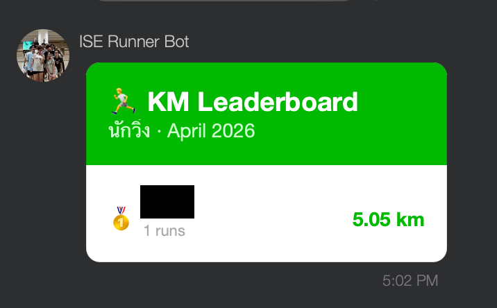
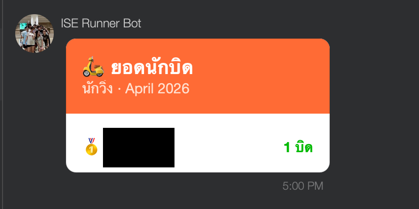
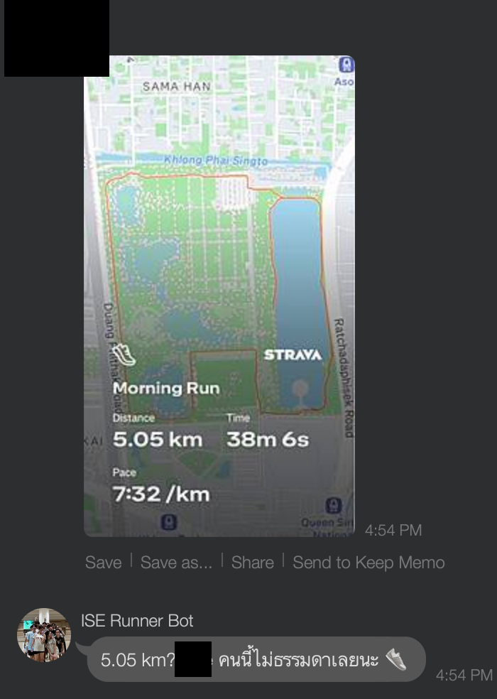

# LINE Runner Bot

A LINE group bot for tracking monthly running scores and keeping bail-outs accountable.

## Commands

| Message | Action |
|---|---|
| `+5.2` | Log KM for yourself |
| `ชื่อ +5.2` | Log KM for someone by name |
| Send a run screenshot | Auto-extract KM via OCR |
| `@mention บิด` | Add a bail-out point |
| `@mention unบิด` | Remove the last bail-out point |
| `/km` or `วิ่ง` | Monthly KM leaderboard |
| `/บิด` or `นักบิด` | Monthly bail-out leaderboard |
| `นักบิดตัวยง` | All-time bail-out hall of fame |
| `ช่วยด้วย` | Show help |

## Screenshots

<table>
  <tr>
    <td></td>
    <td></td>
    <td></td>
  </tr>
  <tr>
    <td align="center">KM Leaderboard</td>
    <td align="center">ยอดนักบิด</td>
    <td align="center">OCR from screenshot</td>
  </tr>
</table>

## Setup

```bash
cp .env.example .env   # fill in LINE_CHANNEL_ACCESS_TOKEN and LINE_CHANNEL_SECRET
npm install
npm run dev            # starts with nodemon + ts-node
```

Expose locally with ngrok and set the webhook URL in LINE Developers Console to `https://<ngrok-url>/webhook`.

## Deploy to Raspberry Pi

```bash
scp .env rpi:code/line-runner-bot/.env   # first time only
./deploy.sh                               # rsync + build + pm2 restart
```
